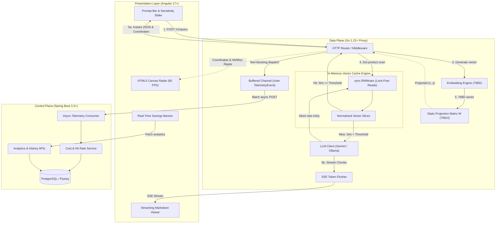

# PromptRadar: Architecture & Implementation Plan

> **System Overview**: High-performance, low-latency semantic caching proxy for LLMs paired with an interactive 2D Vector Radar visualizer.
> **Stack**: Go (Data Plane), Spring Boot (Control Plane), Angular 17+ (Presentation), Redis / PostgreSQL, Docker.

---

## 1. Executive Summary & Goals

### 1.1 The Core Problem
Standard string-matching caches (e.g., Redis key-value) fail for Large Language Models because human prompts have infinite lexical variations for identical semantic intent:
* *"How to sort slice in Go?"*
* *"Golang sort slice example"*

Both mean the exact same thing, but naive caches produce a **100% cache miss rate**, leading to high token costs and 1,000–2,000ms latency per request.

### 1.2 The Solution
**PromptRadar** intercepts LLM requests, computes a high-dimensional vector embedding, searches an in-memory normalized cache using cosine similarity ($768\text{D}$), and returns sub-10ms cached answers on semantic hits.

To make this invisible math observable and captivating, the system projects embeddings into a deterministic 2D coordinate space via a **static projection matrix $W$**, rendering an interactive 2D Vector Radar on an Angular canvas at 60 FPS.

---

## 2. System Architecture & Topology



---

## 3. Mathematical Models & Dimensionality Decoupling

### 3.1 768D Semantic Truth (Cache Decision)
The cache decision is **strictly evaluated in 768-dimensional space**.
Because embedding vectors $\mathbf{u}$ and $\mathbf{v}$ are unit-normalized upon ingestion ($\|\mathbf{u}\| = \|\mathbf{v}\| = 1$), the cosine similarity is a fast dot product:

$$\text{Sim}(\mathbf{u}, \mathbf{v}) = \sum_{i=1}^{768} u_i \cdot v_i$$

* If $\text{Sim} \ge \text{Threshold}$ (e.g., $0.90$): **CACHE HIT**
* If $\text{Sim} < \text{Threshold}$: **CACHE MISS**

### 3.2 2D Projection for Visualization (Decoupled from Cache Logic)
To prevent coordinate drift when new prompts are cached, we avoid computing PCA per query. Instead, an offline precomputed **Static Projection Matrix $\mathbf{W} \in \mathbb{R}^{768 \times 2}$** maps high-dimensional vectors to fixed screen coordinates:

$$\begin{bmatrix} x \\ y \end{bmatrix} = \mathbf{u}_{1 \times 768} \times \mathbf{W}_{768 \times 2}$$

Where $x, y \in [-1.0, 1.0]$. The coordinate system remains static and spatially consistent across all sessions.

---

## 4. Repository Structure (Monorepo)

```bash
prompt-radar/
├── apps/
│   ├── radar-proxy/                 # Go 1.22+ Data Plane
│   │   ├── cmd/server/main.go
│   │   ├── internal/
│   │   │   ├── cache/              # In-memory vector cache & sync.RWMutex
│   │   │   ├── embedding/          # Gemini / Ollama client
│   │   │   ├── math/               # Dot product & matrix multiplication
│   │   │   ├── proxy/              # HTTP handlers & SSE stream flusher
│   │   │   └── telemetry/          # Async buffered channel dispatcher
│   │   └── Dockerfile
│   ├── radar-control-plane/         # Spring Boot 3.3+ Control Plane
│   │   ├── src/main/java/com/radar/
│   │   │   ├── controller/         # REST Analytics endpoints
│   │   │   ├── service/            # Cost calculation & threshold curve service
│   │   │   ├── domain/             # JPA Entities (Prompt, TelemetryLog)
│   │   │   └── repository/         # Spring Data Repositories
│   │   ├── src/main/resources/
│   │   │   ├── db/migration/       # Flyway SQL scripts
│   │   │   └── application.yml
│   │   └── Dockerfile
│   └── radar-ui/                    # Angular 17+ Presentation Layer
│       ├── src/app/
│       │   ├── components/
│       │   │   ├── radar-canvas/   # HTML5 Canvas 60 FPS renderer
│       │   │   ├── prompt-input/   # Search bar & sensitivity slider
│       │   │   ├── stream-view/    # Markdown output & latency comparison
│       │   │   └── metrics-bar/    # Real-time savings and hit rate
│       │   ├── services/           # SSE Stream & REST client
│       │   └── models/             # TypeScript interfaces
│       └── Dockerfile
├── docker/
│   └── docker-compose.yml           # Local dev orchestrator (Go, Spring, Postgres, Angular)
├── scripts/
│   ├── generate_pca_matrix.py       # Offline script generating projection_matrix.json
│   └── seed_prompts.json            # 50 seed prompts across categories
├── PLAN.md                          # This architecture and roadmap file
└── README.md                        # Portfolio documentation & demo instructions
```

---

## 5. Failure Modes, Bottlenecks & Mitigations

| Failure Mode / Bottleneck | Impact | Senior-Level Mitigation |
|---|---|---|
| **Cache Lock Contention** | High concurrent queries stall during reads. | Use `sync.RWMutex`. Concurrent readers acquire shared locks with near-zero latency. Exclusive write locks are only held for microseconds when appending a newly cached miss. |
| **$O(ND)$ Brute Force Growth** | Linear vector scan degrades when cache size $N > 10,000$. | Isolate search behind a clean `VectorIndex` Go interface. For $N < 10,000$, linear SIMD-friendly dot products execute in $<2\text{ms}$. Provide an automatic or configurable upgrade path to **HNSW** (Hierarchical Navigable Small World) or **pgvector**. |
| **Telemetry Network Latency** | Slow Spring Boot responses degrade Go proxy latency. | Decouple telemetry via an in-memory buffered channel `chan TelemetryEvent` (capacity: 2,000). A background worker drains the channel in batches. If Spring Boot is down, data plane query latency is unaffected. |
| **Downstream LLM Stalls** | Slow or hanging LLM API calls tie up HTTP connections. | Enforce strict request timeouts (`context.WithTimeout(ctx, 30*time.Second)`) and graceful client cancellation when users abort requests. |
| **UI Frame Drops During Streaming** | Incoming SSE chunks trigger frequent Angular change detection cycles, causing Canvas stutter. | Run the Canvas render loop outside Angular’s zone (`NgZone.runOutsideAngular`). Maintain 60 FPS while streaming tokens are buffered and flushed at 30ms intervals. |

---

## 6. Phased Implementation Roadmap

### Phase 1: Core Data Plane & End-to-End Slice (Days 1–3)
- [ ] Initialize Go module with `go 1.22`.
- [ ] Implement `embedding` client for Gemini `text-embedding-004` (or local Ollama).
- [ ] Implement in-memory vector store with unit vector normalization and dot-product cosine similarity.
- [ ] Implement query handler:
  - Return JSON immediately on **Cache Hit** ($\text{Sim} \ge \text{Threshold}$).
  - Call LLM and stream response via SSE using `http.Flusher` on **Cache Miss**.
- [ ] Create minimal Angular view to test SSE stream and hit/miss responses.
- **Acceptance Gate**: A duplicate or closely rephrased prompt returns in $<10\text{ms}$ with cached text; a novel prompt streams live LLM tokens.

### Phase 2: Static 2D Projection & Canvas Radar (Days 4–5)
- [ ] Run offline Python script to generate `projection_matrix.json` ($768 \times 2$) from seed prompts.
- [ ] Load projection matrix in Go and calculate $(x, y)$ coordinates for every entry.
- [ ] Build Angular `RadarCanvasComponent`:
  - Draw coordinate grid and axes.
  - Render existing cached nodes with glowing halos.
  - Draw hit-radius circle around the closest neighbor based on the slider value.
  - Animate the active query marker entering vector space.
  - Fire green shockwave on Hit or purple pulse on Miss.
- **Acceptance Gate**: Modifying the sensitivity slider in the UI dynamically expands/contracts hit circles; query marker smoothly animates to its deterministic $(x, y)$ position.

### Phase 3: Control Plane & Real-Time Telemetry (Days 6–7)
- [ ] Initialize Spring Boot 3.3 project with Java 21, Spring Data JPA, and PostgreSQL.
- [ ] Create Flyway database migration for `prompts` and `telemetry_logs` tables.
- [ ] Implement asynchronous `/api/v1/telemetry` ingestion endpoint.
- [ ] Implement `/api/v1/analytics/summary` endpoint returning:
  - Total requests, cache hit rate percentage.
  - Cumulative tokens saved (input vs. output).
  - True dollar savings calculated from model pricing.
  - Time saved compared to baseline LLM latency.
- [ ] Connect Go telemetry worker to push events asynchronously to Spring Boot.
- **Acceptance Gate**: Every query logged by Go appears in PostgreSQL without adding more than $0.1\text{ms}$ to the proxy response time.

### Phase 4: Precision Analysis & Production Polish (Days 8–9)
- [ ] Build **Threshold vs. Hit Rate Curve** component in Angular (visualizing the trade-off curve across $0.80$, $0.85$, $0.90$, $0.95$).
- [ ] Build **Side-by-Side Comparison Card**: `⚡ Cache (6ms) vs 🌐 LLM (1,240ms)`.
- [ ] Write integration tests with **Testcontainers** for Spring Boot + PostgreSQL.
- [ ] Write Go benchmark tests (`BenchmarkCosineSimilarity768D`).
- [ ] Package multi-stage Dockerfiles and top-level `docker-compose.yml`.
- [ ] Create comprehensive `README.md` with architectural diagrams and a demo recording.

---

## 7. Observability & Testing Strategy

### 7.1 Go Performance Benchmarks
Unit benchmark testing ensures vector math remains ultra-fast:
```go
func BenchmarkCosineSimilarity768D(b *testing.B) {
    v1 := make([]float32, 768)
    v2 := make([]float32, 768)
    b.ResetTimer()
    for i := 0; i < b.N; i++ {
        _ = DotProduct(v1, v2)
    }
}
```
*Target*: $< 250\text{ns}$ per comparison on modern hardware, allowing 10,000 comparisons in $< 2.5\text{ms}$.

### 7.2 Integration Tests (Spring Boot + Testcontainers)
Verify telemetry ingestion and aggregation against a real containerized PostgreSQL instance without relying on local mocks.
