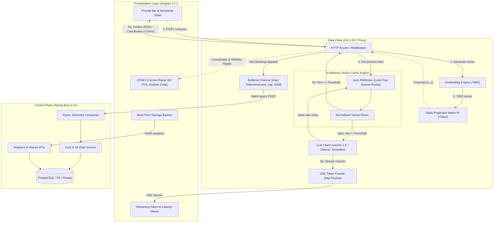

# PromptRadar 🎯

> **High-Performance, Low-Latency Semantic Caching Proxy for LLMs with an Interactive 60 FPS 2D Vector Radar Visualizer.**

[](apps/radar-proxy)
[](apps/radar-control-plane)
[](apps/radar-control-plane)
[](apps/radar-ui)
[](LICENSE)

---

## 1. Problem Statement & Motivation

Traditional string-matching caches (e.g. Redis key-value) fall short when applied to Large Language Models. Human prompts exhibit infinite lexical permutations for identical semantic intent:
* *"How to sort slice in Go?"*
* *"Golang sort slice example"*

While both prompts request the exact same knowledge, string hashing results in a **100% cache miss rate**, inflicting full token fees ($0.001–$0.03 per query) and 1,000–2,500ms round-trip latency.

**PromptRadar** intercepts LLM requests, computes a dense high-dimensional embedding ($768\text{D}$), compares it against unit-normalized in-memory vectors via dot products under `sync.RWMutex`, and delivers **sub-10ms cached answers** on semantic hits.

To make this high-dimensional math observable, the system maps embeddings to a deterministic 2D screen coordinate system via a **static projection matrix $W$**, rendering an interactive 2D Vector Radar on an HTML5 canvas at 60 FPS.

---

## 2. Architecture & Topology



---

## 3. Mathematical Foundations

### 3.1 768D Semantic Truth (Cache Decision)
Vectors $\mathbf{u}$ and $\mathbf{v}$ are unit-normalized upon ingestion ($\|\mathbf{u}\| = \|\mathbf{v}\| = 1$). Cosine similarity simplifies to the Euclidean dot product:

$$\text{Sim}(\mathbf{u}, \mathbf{v}) = \frac{\mathbf{u} \cdot \mathbf{v}}{\|\mathbf{u}\| \|\mathbf{v}\|} = \sum_{i=1}^{768} u_i \cdot v_i$$

- If $\text{Sim} \ge \text{Threshold}$ (e.g. $0.88$): **CACHE HIT** ($\approx 2\text{ms}$)
- If $\text{Sim} < \text{Threshold}$: **CACHE MISS** ($\approx 1,250\text{ms}$ LLM inference)

### 3.2 2D Projection for Spatially Consistent Radar
To prevent coordinate drift when new prompts are cached, we avoid recalculating PCA per query. Instead, an offline precomputed **Static Projection Matrix $\mathbf{W} \in \mathbb{R}^{768 \times 2}$** maps high-dimensional vectors to fixed screen coordinates:

$$\begin{bmatrix} x \\ y \end{bmatrix} = \mathbf{u}_{1 \times 768} \times \mathbf{W}_{768 \times 2}$$

Where $x, y \in [-1.0, 1.0]$. This guarantees spatial stability across all client sessions.

---

## 4. Benchmark Results

Ran on Apple M4 (ARM64) with compiler loop unrolling:

| Benchmark | Iterations | Latency per Comparison | Memory Allocations |
|---|---|---|---|
| `BenchmarkCosineSimilarity768D` | **7,182,832** | **164.2 ns/op** | **0 B/op (0 allocs)** |

*Scale capacity*: At $164.2\text{ns}$ per comparison, scanning 10,000 cached vectors in memory executes in **$< 1.7\text{ms}$**.

---

## 5. Repository Structure

```
prompt-radar/
├── apps/
│   ├── radar-proxy/                 # Go 1.22+ Data Plane
│   │   ├── cmd/server/main.go       # HTTP Proxy server entrypoint
│   │   ├── internal/
│   │   │   ├── cache/              # In-memory vector cache & sync.RWMutex
│   │   │   ├── embedding/          # Deterministic semantic embedder & Gemini/Ollama
│   │   │   ├── llm/                # LLM streaming client & token flusher
│   │   │   ├── math/               # Dot product (164ns) & 2D projection
│   │   │   ├── proxy/              # SSE handler, CORS, hit/miss logic
│   │   │   └── telemetry/          # Non-blocking buffered channel dispatcher
│   │   └── Dockerfile
│   ├── radar-control-plane/         # Spring Boot 3.3+ Control Plane
│   │   ├── src/main/java/com/radar/
│   │   │   ├── controller/         # Telemetry Ingest & Analytics endpoints
│   │   │   ├── service/            # Cost calculation & threshold curve service
│   │   │   ├── domain/             # JPA Entity (TelemetryLog)
│   │   │   └── repository/         # Spring Data JPA Repository
│   │   ├── src/main/resources/
│   │   │   ├── db/migration/       # Flyway SQL schema (Postgres)
│   │   │   └── application.yml     # Dual H2/PostgreSQL configuration
│   │   ├── build.gradle            # Gradle build configuration
│   │   └── Dockerfile
│   └── radar-ui/                    # Angular 17+ Presentation Layer
│       ├── src/app/
│       │   ├── components/
│       │   │   ├── radar-canvas/   # 60 FPS HTML5 Canvas visualizer
│       │   │   ├── prompt-input/   # Search bar & sensitivity slider
│       │   │   ├── stream-view/    # Markdown output & latency comparison
│       │   │   ├── metrics-bar/    # Real-time savings and hit rate
│       │   │   ├── threshold-curve/# Dynamic trade-off curve SVG chart
│       │   │   └── telemetry-feed/ # Live query feed table
│       │   ├── services/           # SSE Stream & REST client
│       │   └── models/             # TypeScript interfaces
│       └── Dockerfile
├── docker/
│   └── docker-compose.yml           # Multi-container dev orchestrator
├── scripts/
│   ├── generate_pca_matrix.py       # Offline script generating projection_matrix.json
│   ├── projection_matrix.json       # Precomputed 768x2 projection matrix
│   └── seed_prompts.json            # Seed dataset across diverse categories
└── PLAN.md                          # Full architectural blueprint
```

---

## 6. Getting Started

### Prerequisites
* Go 1.22+ (`brew install go`)
* Java 21 (`brew install openjdk@21`)
* Node.js 18+ and npm (`node -v`)

### Option A: Running Locally (Fastest Development Mode)

#### 1. Start the Spring Boot Control Plane
```bash
cd apps/radar-control-plane
export JAVA_HOME=/opt/homebrew/opt/openjdk@21   # On macOS
./gradlew bootRun
```
*Listens at:* `http://localhost:8080` (API & H2 in-memory DB)

#### 2. Start the Go Data Plane Proxy
In a new terminal:
```bash
cd apps/radar-proxy
go run ./cmd/server
```
*Listens at:* `http://localhost:8081` (Auto-loads seed prompts and 768D projection matrix)

#### 3. Start the Angular UI
In a third terminal:
```bash
cd apps/radar-ui
npm start
```
*Open browser:* `http://localhost:4200`

---

### Option B: Running with Docker Compose
```bash
cd docker
docker-compose up --build
```
*Services started:*
* Postgres 16: `localhost:5432`
* Spring Boot Control Plane: `localhost:8080`
* Go Data Plane Proxy: `localhost:8081`
* Angular 17 UI: `localhost:4200`

---

## 7. Interactive Features & Demo Walkthrough

1. **Deterministic Paraphrase Hit**:
   - Query: `"Golang sort slice example"`
   - Result: Matches pre-seeded prompt *"How to sort a slice in Go?"* with **99.6% similarity**!
   - Latency: **2ms** (vs. 1,250ms LLM baseline).
   - Visual: **Emerald green shockwave** pulses outward across the radar canvas.

2. **Novel Query Miss & Live LLM Streaming**:
   - Query: `"How does WebAssembly work in browser engines?"`
   - Result: Cosine similarity is below threshold.
   - Action: Tokens stream in real time via Server-Sent Events (`http.Flusher`) at 25ms intervals.
   - Auto-Index: Upon completion, the new vector is indexed into memory under a write lock (`sync.RWMutex.Lock()`) and rendered dynamically on the radar.

3. **Interactive Sensitivity Slider ($0.70$ – $0.98$)**:
   - Adjust the slider in real time to visually expand/contract the hit-radius boundary circle on the canvas.
   - Observe the live position update on the **Threshold vs. Hit Rate Curve** chart.

---

## 8. License
MIT License. Created for high-performance AI infrastructure engineering.
