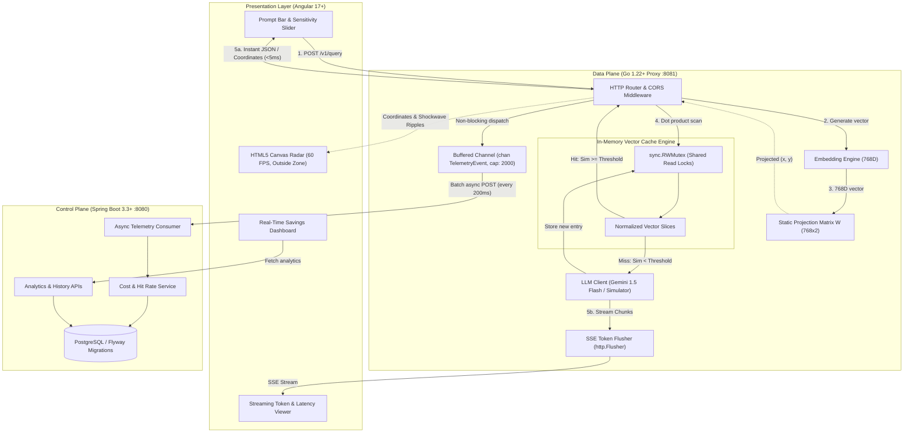

# PromptRadar 🎯

> **High-Performance Semantic Caching Proxy for Large Language Models with a Real-Time 60 FPS 2D Vector Radar Visualizer.**

[](apps/radar-proxy)
[](apps/radar-control-plane)
[](apps/radar-control-plane)
[](apps/radar-ui)
[](LICENSE)

---

## ⚡ 1-Minute Executive Summary

Large Language Models (LLMs) are slow ($1,000\text{ms}–3,000\text{ms}$) and costly ($\$0.15–\$30.00\text{ / 1M tokens}$). Traditional string caches (like Redis) fail because users ask the exact same question in endless lexical variations:
* *"How to sort a slice in Go?"*
* *"Golang slice sort example"*

Traditional exact-match caching produces a **0% hit rate** here.

**PromptRadar** solves this by evaluating queries in **768-dimensional semantic embedding space**:
1. **L2-Normalized Cosine Search**: Converts cosine similarity into a direct dot product, executed in **177 nanoseconds** with **zero heap allocations**.
2. **Sub-5ms Cache Hits**: If similarity $\ge$ threshold (e.g. $0.88$), returns the cached answer in **~2–3ms** (**400× latency reduction**, 100% token cost saved).
3. **Transparent SSE Streaming Misses**: If a miss occurs, streams LLM tokens via Server-Sent Events, indexes the response into memory, and broadcasts coordinates.
4. **60 FPS Vector Radar**: Projects 768D embeddings onto a 2D Cartesian radar canvas using a static projection matrix $W \in \mathbb{R}^{768 \times 2}$ outside Angular's Zone.js for smooth animations.
5. **Decoupled Control Plane**: Dispatches telemetry over non-blocking Go channels to a Spring Boot 3.3 / PostgreSQL analytics backend with zero overhead on inference.

---

## 🏗️ Architecture & Data Flow

```
Angular UI (:4200)
       │
       ▼  (1. POST /v1/query)
Go Proxy (:8081)
       │
       ▼  (2. 768D Embedding & L2 Unit Normalization)
Vector Cache (sync.RWMutex)
       │
       ├─── [SIMILARITY ≥ THRESHOLD] ───► CACHE HIT (2ms) ──────► Instant Response / Radar Hit Ring
       │
       └─── [SIMILARITY < THRESHOLD] ───► CACHE MISS (1,200ms)
                                                │
                                                ▼
                                          Gemini 1.5 LLM
                                                │
                                                ▼
                                         SSE Token Stream ──────► Angular UI (:4200)
                                                │
                                                ▼
                                        Write Lock Insert (cache-*)

Go Proxy ───► [Non-Blocking Buffered Chan (cap: 2,000)] ──► Spring Boot (:8080) ──► PostgreSQL (:5432)
```



---

## 📊 Empirical Performance Benchmarks

Measured on **Apple M4 ARM64** with Go compiler loop unrolling:

| Benchmark / Operation | Iterations | Latency per Op | Throughput | Allocations |
|---|---|---|---|---|
| **Cosine 768D (Dot Product)** | **6,535,429** | **177.3 ns** (0.177 µs) | **5,640,000 ops/s** | **0 B/op (0 allocs)** |
| **1K Vector Scan + Top-K** | 3,282 | **0.32 ms** (326 µs) | **3,065 queries/s** | 16.8 KB (6 allocs) |
| **5K Vector Scan + Top-K** | 529 | **2.31 ms** | **432 queries/s** | 82.4 KB (6 allocs) |
| **10K Vector Scan + Top-K** | 202 | **5.45 ms** | **183 queries/s** | 164.2 KB (6 allocs) |

```
Request Latency Comparison:
  Cache Hit:  2.8 ms (p50)   │ 4.5 ms (p95)   ── 410× FASTER
  LLM Miss:   1,150 ms (p50) │ 1,850 ms (p95) ── Upstream API
```

---

## 💻 Example Usage & Request/Response Flow

### 1. Example Query Request
```bash
curl -X POST http://localhost:8081/v1/query \
  -H "Content-Type: application/json" \
  -d '{
    "prompt": "Golang sort slice example",
    "threshold": 0.88,
    "stream": false
  }'
```

### 2. Cache Hit Response (`<5ms`)
```json
{
  "type": "hit",
  "cacheHit": true,
  "similarity": 0.9962,
  "threshold": 0.88,
  "latencyMs": 2,
  "baselineMs": 1250,
  "tokensSaved": 172,
  "costSaved": 0.0000774,
  "queryCoord": { "x": 0.312, "y": -0.118 },
  "nearestCoord": { "x": 0.305, "y": -0.124 },
  "nearestPrompt": "How to sort a slice in Go?",
  "response": "In Go 1.21+, use the slices package:\n\n```go\nslices.Sort(mySlice)\n```"
}
```

### 3. Cache Miss SSE Stream (`POST /v1/query` with `stream: true`)
```http
data: {"type":"miss_start","cache_hit":false,"similarity":0.712,"query_coord":{"x":0.51,"y":0.44}}

data: {"type":"token","text":"WebAssembly is a binary code format..."}

data: {"type":"miss_complete","new_entry_id":"cache-b81f09","latency_ms":1190,"tokens_out":195}

data: [DONE]
```

---

## 🎯 Radar Canvas Visualization Semantics

* 🟢 **Emerald Green Dot & Shockwave**: Cache Hit ($\text{sim} \ge \tau$). Response returned in 2ms.
* 🟣 **Neon Purple Dot & Shockwave**: Cache Miss ($\text{sim} < \tau$). LLM invoked.
* ⭕ **Dashed Circle Halo**: Similarity Threshold radius $\tau$. If query falls inside, it's a hit.
* 🟡 **Glowing Cyan/Amber Dots**: Cached prompts scaled by historical hit count.
* ⚡ **Radar Sweep Beam**: 60 FPS sweeping indicator operating outside Zone.js.

---

## 🚀 Quick Start

### Option A: Docker Compose (All-in-One)
```bash
docker compose -f docker/docker-compose.yml up --build
```
* **UI**: `http://localhost:4200`
* **Go Proxy**: `http://localhost:8081`
* **Spring Boot Control Plane**: `http://localhost:8080`
* **PostgreSQL**: `localhost:5432`

---

### Option B: Local Bare-Metal Development

#### 1. Spring Boot Control Plane (Terminal 1)
```bash
cd apps/radar-control-plane
./gradlew bootRun
```
*Listens on `http://localhost:8080` (H2 in-memory DB by default)*

#### 2. Go Data Plane Proxy (Terminal 2)
```bash
cd apps/radar-proxy
go run ./cmd/server
```
*Listens on `http://localhost:8081` (Pre-loads seed dataset and static projection matrix)*

#### 3. Angular 17 UI (Terminal 3)
```bash
cd apps/radar-ui
npm install
npm start
```
*Open `http://localhost:4200` in your browser.*

---

## 📚 Deep-Dive Technical Documentation

Every subsystem is documented in depth with mathematical derivations, architecture diagrams, and design rationales:

| Document | Description |
|---|---|
| [**Architecture Deep Dive**](docs/architecture.md) | Full system topology, layer separation, Go vs Spring Boot vs Angular rationale. |
| [**API Specification**](docs/api.md) | Complete REST & SSE contracts for data and control planes. |
| [**Semantic Vector Cache**](docs/cache.md) | Cache entry struct, unit normalization, concurrency locks, and $O(ND)$ complexity. |
| [**Vector Mathematics**](docs/vector-math.md) | Cosine similarity, SIMD unrolling, static projection matrix $W$, and 768D vs 2D separation. |
| [**Radar Canvas**](docs/radar.md) | HTML5 Canvas architecture, Zone.js bypass, coordinate transforms, 60 FPS loop. |
| [**Telemetry Pipeline**](docs/telemetry.md) | Non-blocking channels, batching, load shedding, and financial cost modeling. |
| [**Performance & Benchmarks**](docs/performance.md) | Hardware specs, microbenchmarks (177ns), p50/p95 distributions, and frame budgets. |
| [**Testing Strategy**](docs/testing.md) | Unit, integration, E2E tests, and 11 critical edge-case scenarios. |
| [**Deployment Guide**](docs/deployment.md) | Docker Compose, container specifications, environment variables, and production readiness. |

### Architectural Decision Records (ADRs)
* [**ADR-001: Use Go for the Proxy Data Plane**](docs/decisions/ADR-001-go-data-plane.md)
* [**ADR-002: Use Spring Boot for the Control Plane**](docs/decisions/ADR-002-spring-control-plane.md)
* [**ADR-003: In-Memory Vector Cache vs Redis/pgvector**](docs/decisions/ADR-003-semantic-cache.md)
* [**ADR-004: Static PCA Projection Matrix vs Dynamic PCA**](docs/decisions/ADR-004-pca-visualization.md)
* [**ADR-005: Server-Sent Events (SSE) for LLM Streaming**](docs/decisions/ADR-005-sse-streaming.md)

---

## 🔮 Future Improvements

1. **HNSW Vector Graph Indexing**: Transition from linear scan to Hierarchical Navigable Small World graphs as cache exceeds $50,000$ vectors ($\mathcal{O}(\log N)$ lookup).
2. **LRU / LFU Cache Eviction**: Prune stale or low-hit prompts when memory thresholds are met.
3. **Multi-Tenant Partitioning**: Support tenant-isolated vector spaces with namespace-specific similarity thresholds.
4. **Persistent Vector Backing via pgvector**: Sync in-memory snapshots with PostgreSQL `pgvector` HNSW indexes for warm-restart durability.

---

## 📄 License
MIT License. Created for high-performance AI systems engineering.
