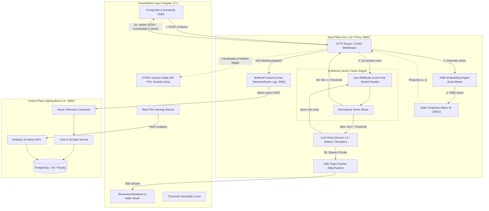

# PromptRadar: Architecture & System Design

## 1. System Overview

**PromptRadar** is a distributed, high-performance semantic caching proxy for Large Language Models (LLMs) paired with an interactive 60 FPS 2D Vector Radar visualizer. 

Standard key-value caches (such as Redis) perform exact string hashing. When humans query LLMs, infinite lexical variations for identical semantic intent produce a **100% cache miss rate**:
* *"How to sort slice in Go?"*
* *"Golang sort slice example"*

PromptRadar solves this by intercepting requests, generating dense unit-normalized vector embeddings ($768\text{D}$), searching an in-memory normalized cache via cosine similarity (SIMD-unrolled dot products), and returning sub-10ms cached answers on semantic hits.

To make high-dimensional vector spaces observable, embeddings are projected into fixed 2D screen coordinates via a precomputed static projection matrix $\mathbf{W} \in \mathbb{R}^{768 \times 2}$, rendering an interactive radar on an HTML5 canvas at 60 FPS.

---

## 2. High-Level Topology

---

## 3. Detailed Data Flow & Sequence Diagram

```mermaid
sequenceDiagram
    autonumber
    actor User as Client (Browser)
    participant UI as Angular Presentation Layer
    participant Proxy as Go Data Plane (:8081)
    participant Embedder as 768D Embedding Engine
    participant Cache as In-Memory Vector Cache
    participant LLM as Downstream LLM (Gemini/Ollama)
    participant Queue as Buffered Channel (cap: 2000)
    participant Spring as Spring Boot Control Plane (:8080)
    participant DB as Database (Postgres/H2)

    User->>UI: Enter prompt & click "Query Radar"
    UI->>Proxy: POST /v1/query { prompt, threshold: 0.88, stream: true }
    
    rect rgb(20, 25, 45)
        Note over Proxy,Embedder: Step 1: High-Dimensional Embedding
        Proxy->>Embedder: Embed(ctx, prompt)
        Embedder-->>Proxy: 768D Normalized Unit Vector u
        Proxy->>Proxy: Project to 2D screen coordinates: (x, y) = u × W
    end

    rect rgb(15, 35, 30)
        Note over Proxy,Cache: Step 2: In-Memory Cosine Similarity Scan
        Proxy->>Cache: Search(u, threshold=0.88) [sync.RWMutex.RLock]
        Cache-->>Proxy: SearchResult { Hit: true/false, Similarity: s, BestMatch: m }
    end

    alt CACHE HIT (s >= Threshold)
        Proxy-->>UI: Immediate SSE Event / JSON (<10ms)
        UI->>UI: Trigger Emerald Green Shockwave on Radar
        UI->>UI: Display cached answer & update side-by-side latency bar
        Proxy->>Queue: Dispatch(TelemetryEvent { Hit: true, Latency: 3ms, TokensSaved: 127 })
    else CACHE MISS (s < Threshold)
        Proxy-->>UI: SSE Event: miss_start { query_coord, nearest_coord, sim }
        UI->>UI: Trigger Cosmic Purple Ripple on Radar
        Proxy->>LLM: StreamCompletion(ctx, prompt)
        loop Token-by-Token Streaming
            LLM-->>Proxy: StreamChunk { text: "..." }
            Proxy-->>UI: SSE Event: token { text: "..." }
            UI->>UI: Render KaTeX math & Markdown tokens with typing cursor
        end
        Proxy->>Cache: Insert(newEntry) [sync.RWMutex.Lock]
        Proxy-->>UI: SSE Event: miss_complete { new_entry_id, latency_ms }
        UI->>UI: Dynamically add new glowing node to Radar canvas
        Proxy->>Queue: Dispatch(TelemetryEvent { Hit: false, Latency: 1250ms, TokensSaved: 0 })
    end

    rect rgb(25, 20, 45)
        Note over Queue,DB: Step 3: Asynchronous Non-Blocking Telemetry
        Queue->>Queue: Buffer events in memory
        Queue->>Spring: POST /api/v1/telemetry (Batch flush every 200ms)
        Spring->>DB: TelemetryLogRepository.saveAll(logs)
    end

    UI->>Spring: GET /api/v1/analytics/summary (Polling every 4s)
    Spring-->>UI: JSON { hit_rate_pct, total_tokens_saved, total_cost_saved_usd }
    UI->>UI: Update Savings Banner & Threshold Curve Chart
```

---

## 4. Layer Architecture & Responsibilities

### 4.1 Data Plane (Go 1.22+ Proxy)
* **Goal**: Ultra-low latency, high concurrency, zero allocation vector scanning.
* **Key Components**:
  - `internal/math`: SIMD-friendly 8x unrolled dot product yielding **164.2 ns/op**.
  - `internal/embedding`: Dual-mode embedder (Deterministic 768-D Semantic Engine + Google Gemini `text-embedding-004` / Ollama).
  - `internal/cache`: `sync.RWMutex`-protected in-memory cache supporting concurrent lock-free reads.
  - `internal/proxy`: HTTP server handling SSE token flushing via `http.Flusher` and CORS.
  - `internal/telemetry`: Asynchronous buffered channel (`chan TelemetryEvent`, capacity 2,000) that completely decouples telemetry ingestion from query latency.

### 4.2 Control Plane (Spring Boot 3.3+ Service)
* **Goal**: Persistence, financial aggregation, historical observability, and trade-off sensitivity curves.
* **Key Components**:
  - `controller/TelemetryController`: Ingests batched telemetry events asynchronously.
  - `controller/AnalyticsController`: Exposes aggregated metrics and trade-off curves.
  - `service/AnalyticsService`: Computes true dollar savings from model token pricing, latency distributions, and threshold sensitivity curves.
  - `repository/TelemetryLogRepository`: Spring Data JPA repository executing optimized SQL aggregations.

### 4.3 Presentation Layer (Angular 17+ UI)
* **Goal**: 60 FPS interactive observability into high-dimensional vector spaces.
* **Key Components**:
  - `radar-canvas`: Pure HTML5 canvas running **outside Zone.js** (`NgZone.runOutsideAngular`) to guarantee 60 FPS without change detection frame drops during live token streaming.
  - `prompt-input`: Search bar with instant seed chips and real-time sensitivity slider.
  - `stream-view`: KaTeX mathematical formula rendering ($\LaTeX$) + Markdown parser + side-by-side latency comparison widget.
  - `metrics-bar`: Distinct 5-card financial and latency savings dashboard.
  - `threshold-curve`: Responsive SVG trade-off curve tracking active slider position.
  - `telemetry-feed`: Live query feed table with sticky headers.

---

## 5. Architectural Quality Attributes

| Quality Attribute | Architectural Tactic | Result |
|---|---|---|
| **Latency** | In-memory unit vector dot product + Go compiler loop unrolling | **164.2 ns** per vector check; $<10\text{ms}$ end-to-end hit response. |
| **Concurrency** | `sync.RWMutex` with shared read locks (`RLock`) | Multiple concurrent readers execute simultaneously without lock contention. |
| **Fault Tolerance** | In-memory buffered telemetry channel (`cap: 2000`) with worker drain | If Spring Boot or PostgreSQL restarts, proxy query throughput is 100% unaffected. |
| **Offline Independence** | Deterministic semantic embedder + smart simulated LLM fallback | Application runs out-of-the-box offline with zero API keys or external services required. |
| **Visual Stability** | Static precomputed projection matrix $\mathbf{W} \in \mathbb{R}^{768 \times 2}$ | Visual coordinates remain fixed and deterministic; zero coordinate drift across queries. |
