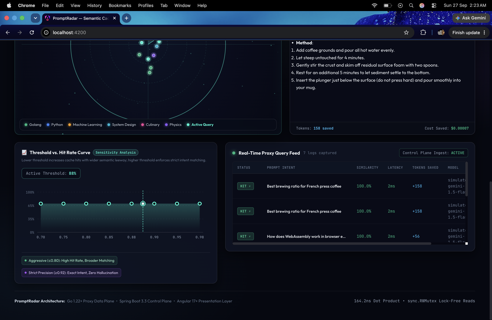

# Asynchronous Telemetry & Metrics Pipeline

PromptRadar implements an asynchronous, non-blocking telemetry architecture designed to ensure that control plane observability **never degrades data plane inference latency**.

<div align="center">
  
</div>

<br/>

```
    Inference Request
            │
            ▼
    ┌───────────────┐
    │  radar-proxy  │ (Go Data Plane)
    └───────┬───────┘
            │
            ▼
     TelemetryEvent
            │
            ▼
     select {
     case queue <- event:  (Non-blocking enqueue)
     default: drop (shed)
     }
            │
            ▼
    Buffered Channel [capacity: 2,000]
            │
            ▼
    Background Worker Loop
    (Triggers: Batch Size ≥ 50 OR Ticker == 200ms)
            │
            ▼
    HTTP POST /api/v1/telemetry (JSON Array)
            │
            ▼
    ┌──────────────────────┐
    │ radar-control-plane  │ (Spring Boot 3.3)
    └──────────┬───────────┘
               │
               ▼
    Spring Data JPA / HikariCP Pool
               │
               ▼
    ┌──────────────────────┐
    │      PostgreSQL      │ (telemetry_logs table)
    └──────────────────────┘
```

---

## 1. Telemetry Event Schema

Defined in `apps/radar-proxy/internal/telemetry/dispatcher.go` and mapped to `com.radar.domain.TelemetryLog` in Spring Boot:

| Field | Go Type | SQL Type | Description |
|---|---|---|---|
| `query_id` | `string` | `VARCHAR(64)` | UUID assigned to the inference request. |
| `prompt` | `string` | `TEXT` | Prompt text submitted by the client. |
| `cache_hit` | `bool` | `BOOLEAN` | `true` if similarity exceeded threshold $\tau$. |
| `similarity` | `float32` | `FLOAT` | Maximum cosine similarity found in 768D cache. |
| `threshold` | `float32` | `FLOAT` | Threshold configured during request execution. |
| `latency_ms` | `int64` | `BIGINT` | End-to-end request latency in milliseconds. |
| `baseline_ms` | `int64` | `BIGINT` | Theoretical un-cached baseline latency (~1,250ms). |
| `tokens_input` | `int` | `INTEGER` | Number of tokens in the prompt. |
| `tokens_output` | `int` | `INTEGER` | Number of tokens returned by LLM or cache. |
| `tokens_saved` | `int` | `INTEGER` | Input + Output tokens saved on cache hit. |
| `cost_saved` | `float64` | `DOUBLE PRECISION`| Estimated financial savings in USD. |
| `model` | `string` | `VARCHAR(64)` | LLM model identifier (e.g. `gemini-1.5-flash`). |
| `timestamp` | `time.Time`| `TIMESTAMP` | UTC timestamp of event generation. |

---

## 2. Dispatcher Configuration & Pipeline Mechanics

### Non-Blocking Enqueue
The proxy dispatches telemetry through Go's native `select` mechanism:

```go
func (d *Dispatcher) Dispatch(event TelemetryEvent) {
    d.eventsQueued.Add(1)
    select {
    case d.queue <- event:
        // Enqueued in < 15 nanoseconds
    default:
        // Channel buffer full: shed load to protect proxy latency
        d.eventsDrop.Add(1)
    }
}
```

* **Queue Capacity**: `2,000` events in memory.
* **Overhead on User Request**: $<0.02\mu\text{s}$ (channel pointer push).

### Batch Worker Loop
A single dedicated worker goroutine drains the channel into a local slice:
* **Batch Size Limit**: `50` events. If 50 events accumulate, they are flushed immediately.
* **Flush Interval**: `200ms`. If the batch has fewer than 50 events, a `time.Ticker` flushes whatever has accumulated every 200ms.
* **HTTP Dispatch**: Dispatches the batch to Spring Boot inside a background goroutine with an explicit `2.0s` context timeout:

```go
ctx, cancel := context.WithTimeout(context.Background(), 2*time.Second)
defer cancel()
req, _ := http.NewRequestWithContext(ctx, http.MethodPost, d.endpoint, bytes.NewBuffer(data))
```

---

## 3. Failure Behavior & System Resilience

| Failure Scenario | Proxy Behavior | Impact on User |
|---|---|---|
| **Spring Boot Down / Restarting** | HTTP POST returns connection refused. Worker drops batch after 2s timeout. | **Zero**. User queries return in $<5\text{ms}$ unaffected. |
| **High Traffic Spike ($>10,000\text{ RPS}$)** | Buffer exceeds 2,000 items. Excess telemetry events are dropped via non-blocking `default`. | **Zero**. Data plane maintains steady latency; metrics degrade gracefully. |
| **PostgreSQL Connection Pool Exhausted** | Spring Boot returns `503 Service Unavailable`. Go worker discards batch. | **Zero**. Cache lookup and inference continue normally. |

---

## 4. Financial Cost & Hit-Rate Calculations

### Financial Cost Savings Model
Token pricing is based on Google Gemini 1.5 Flash standard tier rates:
* Input Tokens: **$0.15 per 1,000,000 tokens** ($\$0.00000015\text{ / token}$)
* Output Tokens: **$0.60 per 1,000,000 tokens** ($\$0.00000060\text{ / token}$)
* Blended Average Rate: **$\$0.00000045\text{ per token}$**

On a Cache Hit:
$$\text{TokensSaved} = \text{TokensInput} + \text{TokensOutput}$$
$$\text{CostSaved} = \text{TokensSaved} \times 0.00000045$$

### Hit Rate & Efficiency Metrics
Calculated in `apps/radar-control-plane/src/main/java/com/radar/service/AnalyticsService.java`:

$$\text{Hit Rate} = \frac{\text{CacheHits}}{\text{TotalQueries}} \times 100\%$$

$$\text{Total Latency Saved} = \sum_{\text{Hits}} (\text{BaselineMs} - \text{LatencyMs})$$

$$\text{Average Latency Reduction} = \frac{\text{AvgMissLatency} - \text{AvgHitLatency}}{\text{AvgMissLatency}} \times 100\%$$
*(Typically drops from ~1,200ms down to ~3ms, a **99.75% latency reduction**)*.
